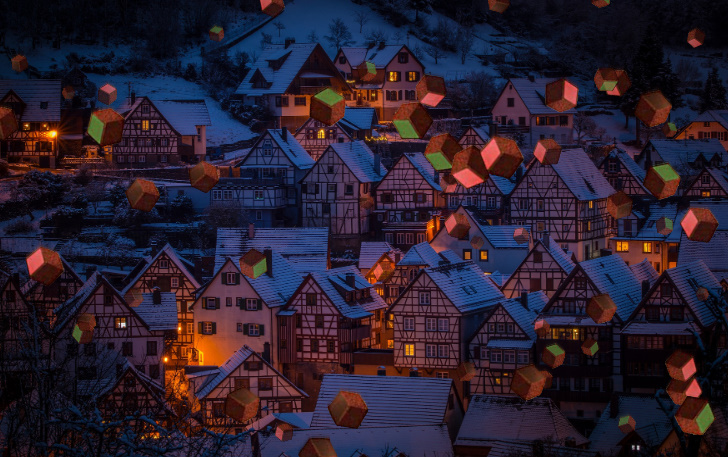

# Melty Kiss Part2
In this program I attmped to create a snowfall simulation.
It would be great if all the snowflake were chocolate.

This is based on The Coding Train's [Snowfall](https://github.com/CodingTrain/website/tree/master/CodingChallenges/CC_088_snowfall)

[DEMO](https://sho373.github.io/CodingChallenge/03_MeltyKissSnowfall_02/)

