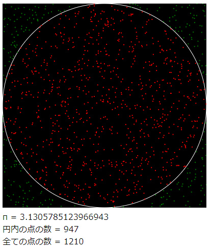

# Monte Carlo Pi
In this program I attmped to estimate the value of pi by Monte Carlo simulation. 
This is based on The Coding Train's [CC_095_Approximating_Pi](https://github.com/CodingTrain/website/tree/master/CodingChallenges/CC_095_Approximating_Pi)

