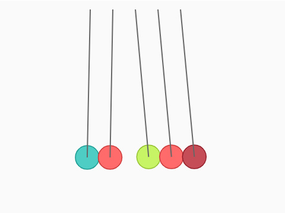

# Newton's Cradle
In this program I attemp to simulate Newton's Cradle by using physics engine Matter.js, a 2D JavaScript physics library. 

[DEMO](https://sho373.github.io/CodingChallenge/05_Newton'sCradle/)

