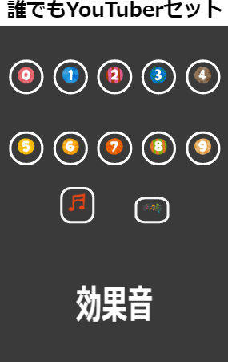

# Japanese Youtuber Sound Effects 

I attempt to make a tool to play with sounds effects in JavaScript, HTML and CSS.

You can choose bgm or sounds effect by clicking two buttons bellow with mark of musicical notes.

Image: [いらすとや](https://www.irasutoya.com/)

Sounds Effect: [効果音ラボ](https://soundeffect-lab.info/)・[くらげ工匠](http://www.kurage-kosho.info/index.html)

BGM:・[DOVA-SYNDROME](https://dova-s.jp/)
・[甘茶の音楽工房](https://amachamusic.chagasi.com/)
