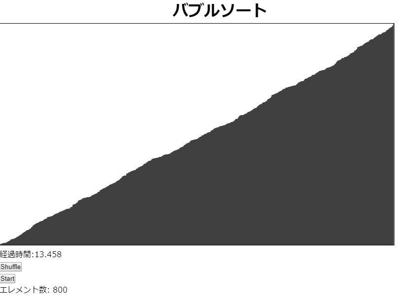

# Bubble Sort Visualization

A tool to visualize bubble sort algorithm in JavaScript, HTML and CSS.

(kind of selection sort)

This is based on Bubble Sort from The Coding Train: ["Coding Challenge #114: Bubble Sort Visualization"](https://youtu.be/67k3I2GxTH8) 

[DEMO](https://sho373.github.io/CodingChallenge/10_Bubble_Sort/)

