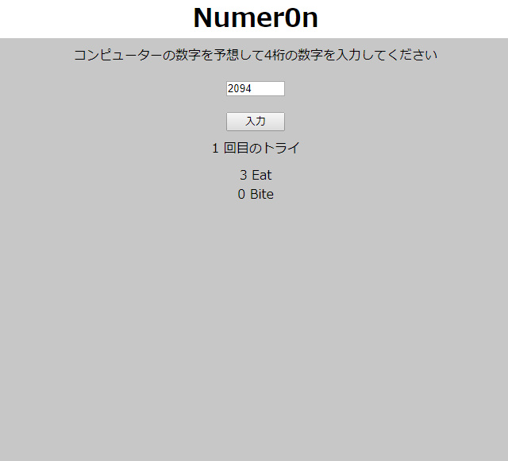
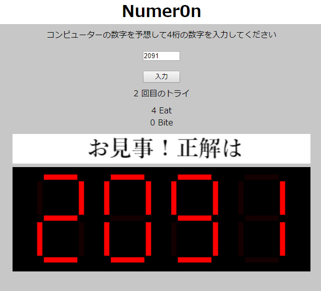

# Numeron (Hit and Blow) & 7 segment display
In this program I attmped to create the game of the puzzle of numbers which is called "Hit and Blow" (Numeron).

This is based on The Coding Train's "[Coding Challenge #117: Seven-Segment Display](https://youtu.be/MlRlgbrAVOs)" and also it was inspired by Shibata Bohyoh's book "[新・明解C言語中級編](https://www.amazon.co.jp/gp/product/B00W4O6A36/ref=dbs_a_def_rwt_hsch_vapi_tkin_p1_i7)"

[DEMO](https://sho373.github.io/CodingChallenge/12_Numeron_7_segment/)

