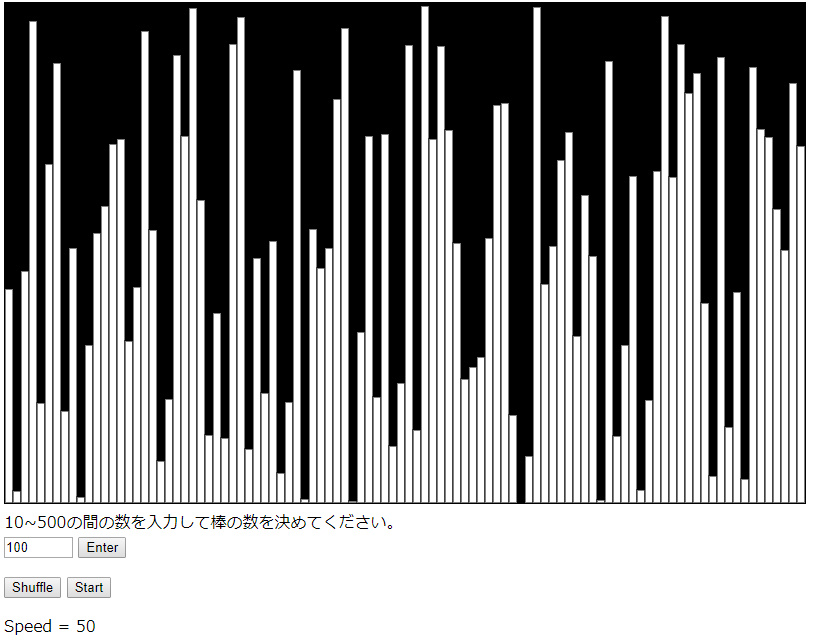
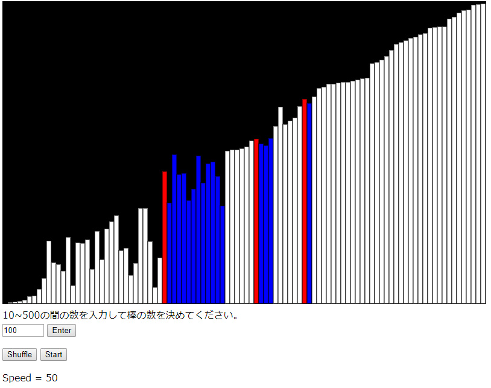

# Quick Sort Visualization

A tool to visualize Quick sort algorithm in JavaScript, HTML and CSS.

This is based on Quick Sort from The Coding Train: ["Coding Challenge #143: Quicksort Visualization"](https://youtu.be/eqo2LxRADhU) 

I just added shuffle and start buttons, also slider to change the speeds of sorting. 

[DEMO](https://sho373.github.io/CodingChallenge/15_Quick_Sort/)

Before sotring

