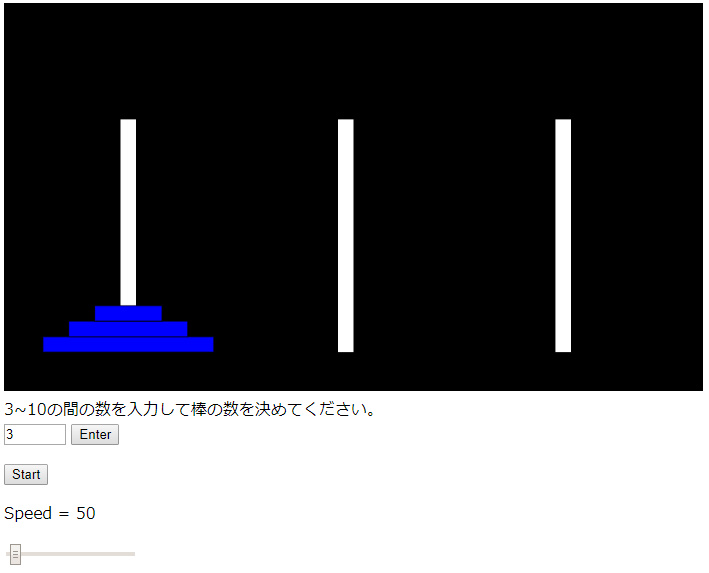

# Tower of Hanoi Visualization

A tool to visualize Tower of Hanoi Algorithm in JavaScript.

This is inspired by the book ["プログラマの数学"](https://www.amazon.co.jp/dp/B079JLW5YN/ref=dp-kindle-redirect?_encoding=UTF8&btkr=1) written by 結城 浩 and also "Quick Sort Visualization" from The Coding Train: ["Coding Challenge #143: Quicksort Visualization"](https://youtu.be/eqo2LxRADhU) 

[DEMO](https://sho373.github.io/CodingChallenge/16_Tower_of_Hanoi/)

